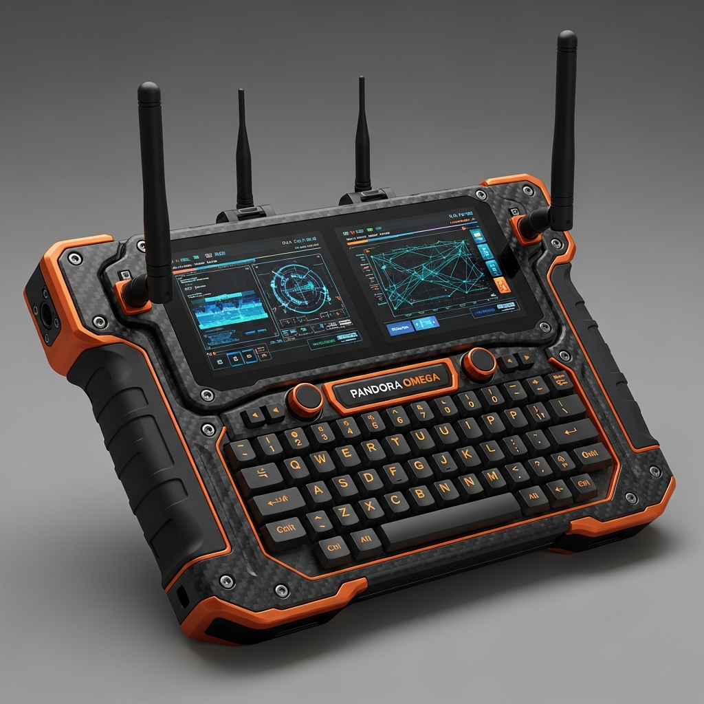

# Pandora Omega: Instruction Manual
## "The handheld cyberdeck for network warfare"

### 1. OVERVIEW
The Pandora Omega is a high-performance handheld cyberdeck designed for deep network penetration and signal interception. Built on the Radxa CM5, it features a dual-screen layout and an integrated mechanical keyboard.

### 2. HARDWARE INTERFACE (BUTTON MAP)
- **Power Switch (Recessed)**: Main system power.
- **L/R Shoulder Triggers**: Tab navigation in JanusOS.
- **Mechanical Keyboard**: Full QWERTY for terminal commands and Lua script editing.
- **Trackball (Tactical)**: Precise selection in OSINT Oracle maps.
- **Antenna Toggles**: Independent power control for Wi-Fi 6E, 5G, and SDR radios.

### 3. OPERATION
- **Network Discovery**: Use the Wi-Fi Marauder module to map local environments.
- **Signal Tracking**: Deploy the OSINT Oracle to correlate cellular towers with geo-profiles.
- **Expansion**: Utilize the rear NVMe slots for massive forensics data storage.

### 4. MAINTENANCE
- **Cooling**: Keep the active fan intake clear during heavy cryptographic offloading.
- **Armor**: Carbon fiber chassis is impact resistant but avoid direct submersion.
