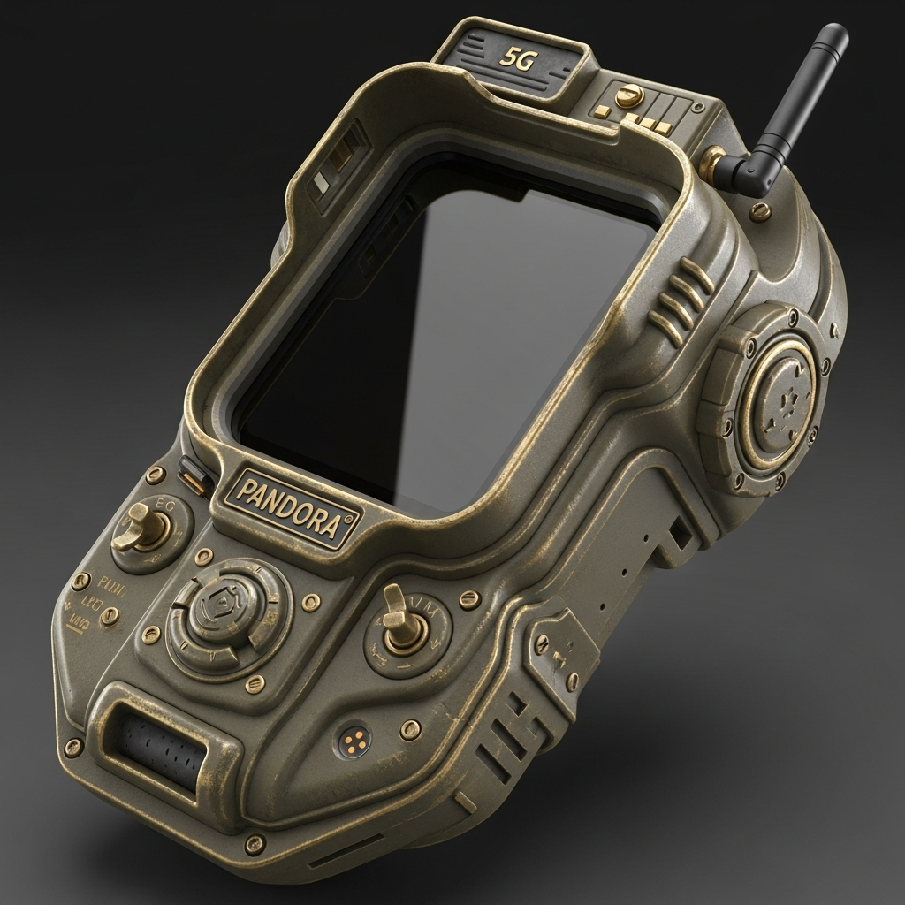

# Pandora Titan: Instruction Manual
## "The forearm-mounted tactical singularity"

### 1. OVERVIEW
The Pandora Titan is the ultimate realization of the Janus project. It is a 7-inch, ultra-widescreen rugged terminal designed to be worn on the forearm. It provides real-time signal intelligence, CBRN detection, and advanced mobile forensics in a heavy industrial "Vault-Tec" inspired chassis.

### 2. HARDWARE INTERFACE (BUTTON MAP)
- **Brass Toggle (Master Power)**: Engages the 4-second boot sequence.
- **Large Top Knob**: CRT Horizontal/Vertical Sync calibration.
- **Small Bottom Knob**: Screen Gain and monochrome intensity.
- **Tactical Button (Side)**: Confirms 'Panic Wipe' or 'Trigger Glitch' actions.
- **Haptic Sensors (Inner Strap)**: Link to Neural-Sync controller for hands-free intent detection.
- **Mjolnir Battery Slot**: Rear magnetic hatch for hot-swapping 21700 cells.

### 3. OPERATION
- **Deployment**: Secure the ballistic nylon straps to your non-dominant forearm using the heavy-duty buckles.
- **Activation**: Rotate the primary brass dial. The green monochrome interface will flicker to life in < 4 seconds.
- **AR-HUD**: Sync your tactical glasses via the 5G/Wi-Fi 6E bridge for real-time threat highlighting.

### 4. MAINTENANCE
- **Sealing**: Ensure all environmental seals are clicked into place before CBRN exposure.
- **Battery**: Hot-swap 21700 cells using the magnetic rear hatch.
- **Calibration**: Use the side-mounted knobs to adjust screen horizontal/vertical sync if the CRT-style display flickers.
